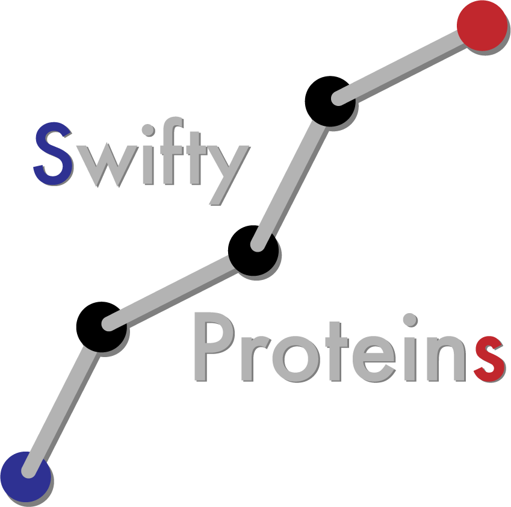
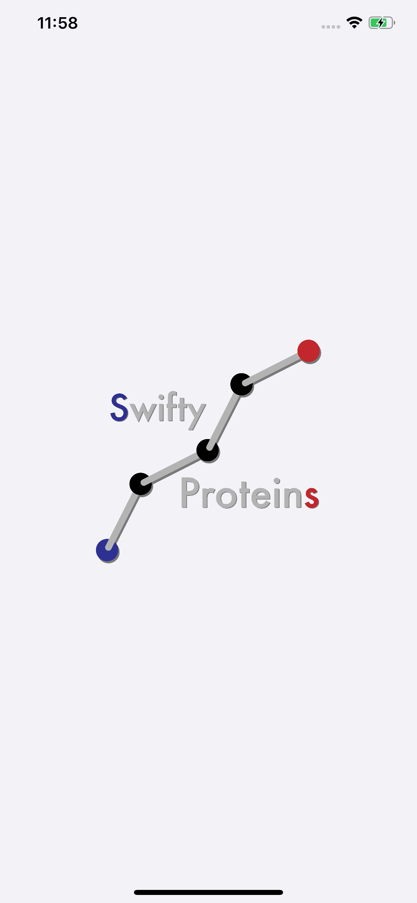
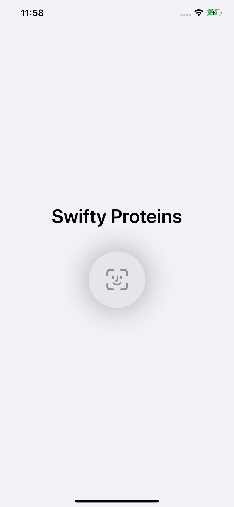
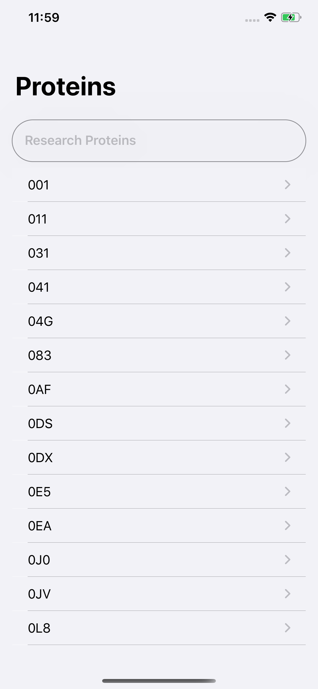
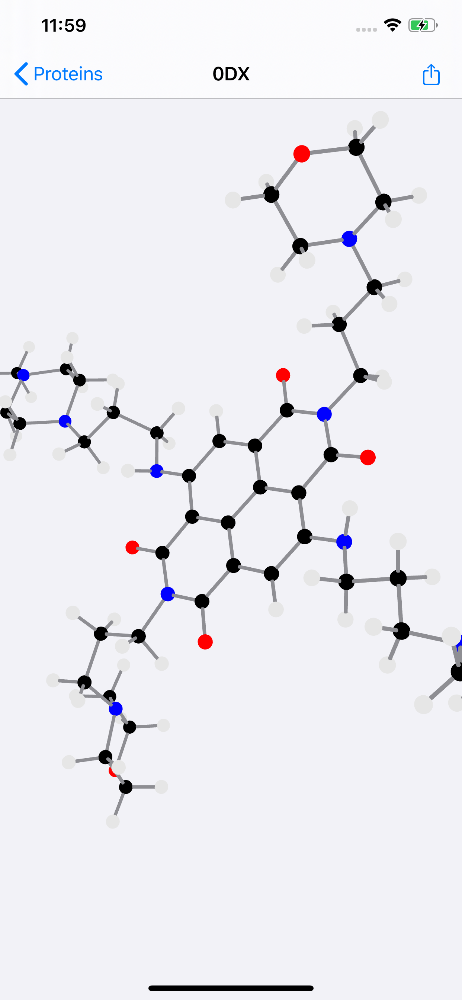
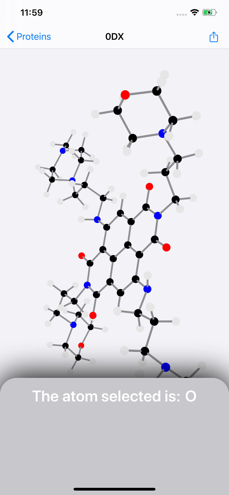
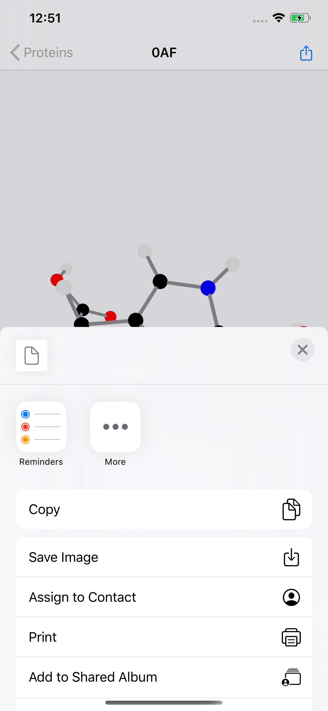

<h1 align="center">
 

 
</h1>

<h3 align="center">Project 42, where we have to create an iOS application from scratch.</h3>

---

## Description

Swifty Proteins is not available on the AppStore because it's a project to learn Swift and Xcode.

This application contain:
 - 3D views of proteins with the Apple SceneKit framework.
 - A LaunchScreen and an icon
 - Authentication via FaceID or TouchID
 - A menu to share a protein view
 - ...

## Technologies

The technologies I used to make this project happen are:
 - SwiftUI
 - Swift 5
 - Xcode 11.4
 - iOS 13.4
 - SceneKit

## Views

